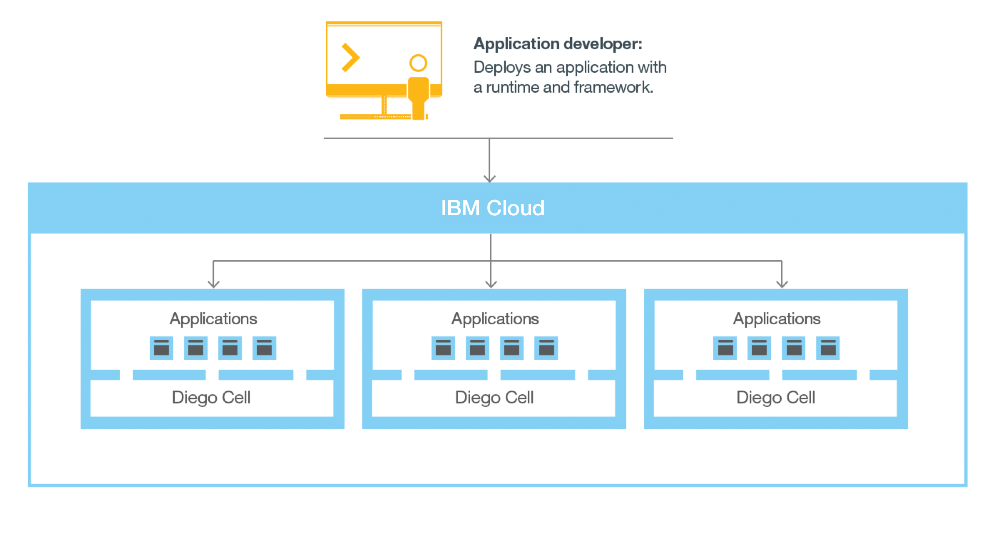
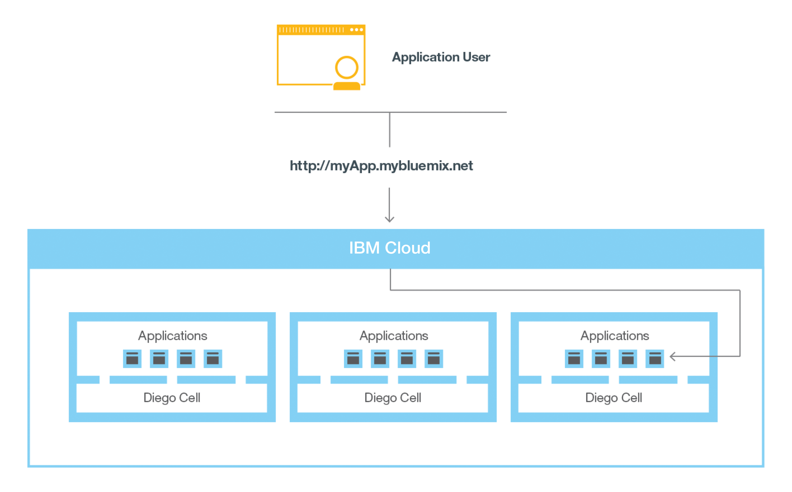
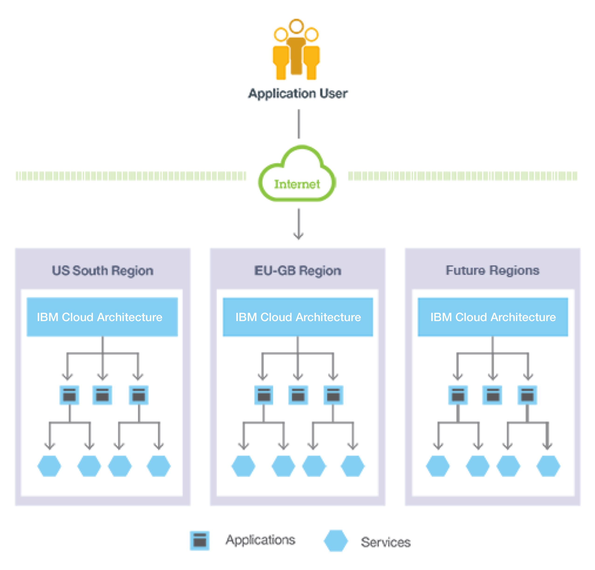

---

copyright:
  years: 2015, 2020
lastupdated: "2020-08-06"

keywords: cloud foundry

subcollection: cloud-foundry-public


---


{:DomainName: data-hd-keyref="APPDomain"}
{:DomainName: data-hd-keyref="DomainName"}
{:android: data-hd-operatingsystem="android"}
{:apikey: data-credential-placeholder='apikey'}
{:app_key: data-hd-keyref="app_key"}
{:app_name: data-hd-keyref="app_name"}
{:app_secret: data-hd-keyref="app_secret"}
{:app_url: data-hd-keyref="app_url"}
{:authenticated-content: .authenticated-content}
{:beta: .beta}
{:c#: data-hd-programlang="c#"}
{:codeblock: .codeblock}
{:curl: .ph data-hd-programlang='curl'}
{:deprecated: .deprecated}
{:dotnet-standard: .ph data-hd-programlang='dotnet-standard'}
{:download: .download}
{:external: target="_blank" .external}
{:faq: data-hd-content-type='faq'}
{:fuzzybunny: .ph data-hd-programlang='fuzzybunny'}
{:generic: data-hd-operatingsystem="generic"}
{:generic: data-hd-programlang="generic"}
{:gif: data-image-type='gif'}
{:go: .ph data-hd-programlang='go'}
{:help: data-hd-content-type='help'}
{:hide-dashboard: .hide-dashboard}
{:hide-in-docs: .hide-in-docs}
{:important: .important}
{:ios: data-hd-operatingsystem="ios"}
{:java: #java .ph data-hd-programlang='java'}
{:java: .ph data-hd-programlang='java'}
{:java: data-hd-programlang="java"}
{:javascript: .ph data-hd-programlang='javascript'}
{:javascript: data-hd-programlang="javascript"}
{:new_window: target="_blank"}
{:note: .note}
{:objectc data-hd-programlang="objectc"}
{:org_name: data-hd-keyref="org_name"}
{:php: data-hd-programlang="php"}
{:pre: .pre}
{:preview: .preview}
{:python: .ph data-hd-programlang='python'}
{:python: data-hd-programlang="python"}
{:route: data-hd-keyref="route"}
{:row-headers: .row-headers}
{:ruby: .ph data-hd-programlang='ruby'}
{:ruby: data-hd-programlang="ruby"}
{:runtime: architecture="runtime"}
{:runtimeIcon: .runtimeIcon}
{:runtimeIconList: .runtimeIconList}
{:runtimeLink: .runtimeLink}
{:runtimeTitle: .runtimeTitle}
{:screen: .screen}
{:script: data-hd-video='script'}
{:service: architecture="service"}
{:service_instance_name: data-hd-keyref="service_instance_name"}
{:service_name: data-hd-keyref="service_name"}
{:shortdesc: .shortdesc}
{:space_name: data-hd-keyref="space_name"}
{:step: data-tutorial-type='step'}
{:subsection: outputclass="subsection"}
{:support: data-reuse='support'}
{:swift: #swift .ph data-hd-programlang='swift'}
{:swift: .ph data-hd-programlang='swift'}
{:swift: data-hd-programlang="swift"}
{:table: .aria-labeledby="caption"}
{:term: .term}
{:tip: .tip}
{:tooling-url: data-tooling-url-placeholder='tooling-url'}
{:troubleshoot: data-hd-content-type='troubleshoot'}
{:tsCauses: .tsCauses}
{:tsResolve: .tsResolve}
{:tsSymptoms: .tsSymptoms}
{:tutorial: data-hd-content-type='tutorial'}
{:unity: .ph data-hd-programlang='unity'}
{:url: data-credential-placeholder='url'}
{:user_ID: data-hd-keyref="user_ID"}
{:vb.net: .ph data-hd-programlang='vb.net'}
{:video: .video}

# How Cloud Foundry works with {{site.data.keyword.cloud_notm}}
{: #howwork}

<!-- This file is reused in the CF Public subcollection. And it needs a short desc, and replace instances of "bluemix" in Figure 3 and the command names with "IBM Cloud." -->

When you deploy an app to Cloud Foundry, you must configure {{site.data.keyword.cloud}} with enough information to support the app.

* For a mobile app, {{site.data.keyword.cloud_notm}} contains an artifact that represents the mobile app's back end, such as the services that the mobile app uses to communicate with a server.
* For a web app, you must ensure that information about the runtime and framework is communicated to {{site.data.keyword.cloud_notm}}, so that {{site.data.keyword.cloud_notm}} can set up the appropriate execution environment to run the app.

Each execution environment, including both mobile and web, is isolated from the execution environment of other apps. The execution environments are isolated even though these apps are on the same physical machine. The following figure shows the basic flow of how Cloud Foundry manages the deployment of apps in {{site.data.keyword.cloud_notm}}:



Figure 1. Deploying an app

When you create an app and deploy it to Cloud Foundry, the {{site.data.keyword.cloud_notm}} environment determines an appropriate virtual server to send the app, or the artifacts that the app represents, to. For a mobile app, a mobile back-end projection is created on {{site.data.keyword.cloud_notm}}. Any code for the mobile app running in the cloud eventually runs in the {{site.data.keyword.cloud_notm}} environment. For a web app, the code running in the cloud is the app itself that the developer deploys to {{site.data.keyword.cloud_notm}}. The determination of the virtual server is based on several factors, including:

* The load already on the machine
* Runtimes or frameworks supported by that virtual server.

After a virtual server is chosen, an application manager on each virtual server installs the appropriate framework and runtime for the app. Then, the app can be deployed into that framework. When the deployment completes, the application artifacts are started.

The following figure shows the structure of a virtual server, also known as Droplet execution agent (DEA), that has multiple apps deployed to it:


Figure 2. Design of a virtual server

In each virtual server, an application manager communicates with the rest of the {{site.data.keyword.cloud_notm}} infrastructure, and manages the apps that are deployed to this virtual server. Each virtual server has containers to separate and protect apps. In each container, {{site.data.keyword.cloud_notm}} installs the appropriate framework and runtime that are required for each app.

When the app is deployed, if it has a web interface (as for a Java web app), or other REST-based services (such as mobile services exposed publicly to the mobile app), users of the app can communicate with it by using normal HTTP requests.



Figure 3. Invoking an {{site.data.keyword.cloud_notm}} app

Each app can have one or more URLs associated with it, but they must all point to the {{site.data.keyword.cloud_notm}} endpoint. When a request comes in, {{site.data.keyword.cloud_notm}} examines the request, determines which app it is intended for, then selects an instance of the app to receive the request.


## Cloud Foundry architecture in {{site.data.keyword.cloud_notm}}
{: #architecture}

In general, you don't have to worry about the operating system and infrastructure layers when running apps on {{site.data.keyword.cloud_notm}} in Cloud Foundry. Layers such as root filesystems and middleware components are abstracted so that you can focus on your application code. However, you can learn more about these layers if you need specifics on where your app is running.

See [Viewing {{site.data.keyword.cloud_notm}} infrastructure layers](/docs/cloud-foundry-public?topic=cloud-foundry-public-howwork#viewinfra) for details.

As a developer, you can interact with the {{site.data.keyword.cloud_notm}} infrastructure by using a browser-based user interface. You can also use a Cloud Foundry command line interface, called cf, to deploy web apps.

Clients--which can be mobile apps, apps that run externally, apps that are built on {{site.data.keyword.cloud_notm}}, or developers that are using browsers--interact with the {{site.data.keyword.cloud_notm}}-hosted apps. Clients use REST or HTTP APIs to route requests through {{site.data.keyword.cloud_notm}} to one of the app instances or the composite services.

The following figure shows the high-level Cloud Foundry architecture on {{site.data.keyword.cloud_notm}}.


Figure 4. Cloud Foundry architecture on {{site.data.keyword.cloud_notm}}

You can deploy your apps to different {{site.data.keyword.cloud_notm}} regions, for latency or security considerations. You can choose to deploy either to one region or across multiple regions.




Figure 5. Multi-region application deployment

{{site.data.keyword.cloud_notm}} infrastructure layers
{: #infralayers}


{{site.data.keyword.cloud_notm}} abstracts and hides operating system and infrastructure layers, so that you don't need to manage them. However, sometimes you might want to know more about the operating system and middleware for your app.
{: shortdesc}

### Viewing {{site.data.keyword.cloud_notm}} infrastructure layers
{: #viewinfra}

You can run the **ibmcloud cf stacks** command to show the available stacks, or root filesystems, that your apps are to be deployed to. You can also specify the stack when you use the **ibmcloud cf push** command with the *-s* option and the *stack_name*, where the stack_name is the root filesystem. IBM Cloud Foundry Public only supports `cflinuxfs3` currently:

```
ibmcloud cf push <APP_NAME> -s STACK
```

You can use the `ibmcloud cf buildpacks` command to show the available buildpacks, such as Liberty for Java and SDK for Node.js, that are available as runtimes for your app to run in. And you can specify the runtime environment for your app by using the following command:

```
ibmcloud cf push <APP_NAME> -b BUILDPACK_NAME
```


